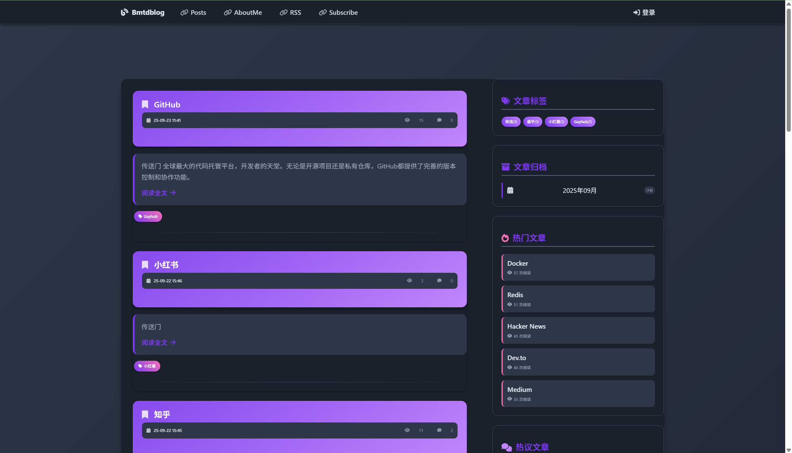
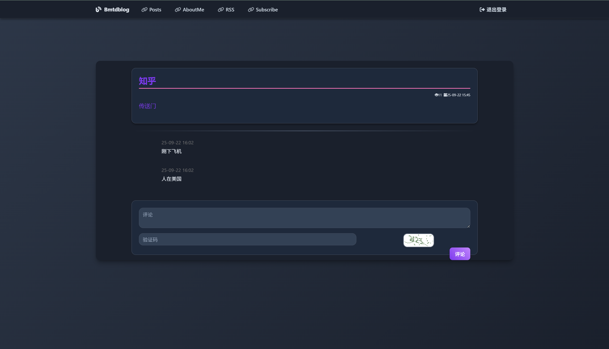
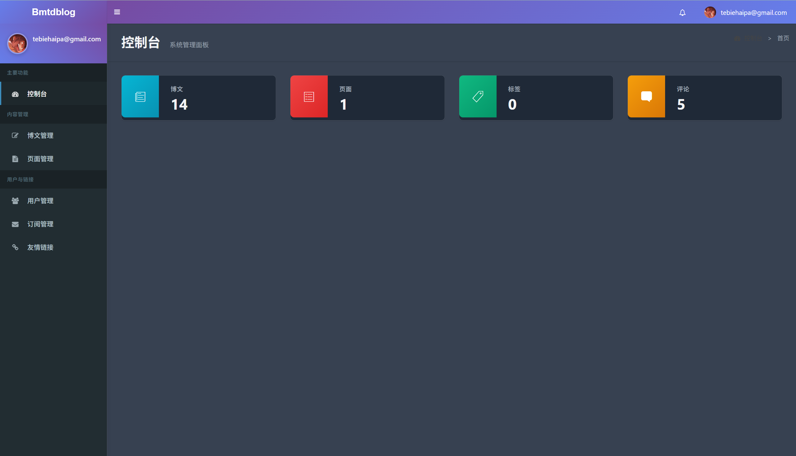

# Bmtdblog

一个基于 Go 语言和 Gin 框架开发的简洁博客系统，支持文章管理、用户订阅、GitHub 登录等功能。

## 功能特性

- **文章管理**: 支持 Markdown 编写，分类标签管理
- **用户系统**: 支持传统账号密码登录和 GitHub OAuth 登录
- **邮件订阅**: 用户可订阅博客更新，支持邮箱验证和取消订阅
- **评论系统**: 支持文章评论和管理
- **数据备份**: 支持七牛云备份
- **图片上传**: 支持 SMMS 图床和七牛云存储
- **RSS 订阅**: 自动生成 RSS feed
- **响应式设计**: 支持移动端访问

## 技术栈

- **后端**: Go + Gin + GORM + slog + viper
- **数据库**: MySQL
- **前端**: HTML + JavaScript + Bootstrap
- **邮件服务**: gomail
- **认证**: OAuth2 (GitHub)
- **图床**: SMMS / 七牛云
- **其他**: Markdown 解析、HTML 安全过滤

## 实践展示
### 前台展示





### 后台管理



## 快速开始

### 环境要求

- Go 1.21+
- MySQL 5.7+
- 邮箱 SMTP 服务（可选）

### 安装步骤

1. **克隆项目**
```bash
git clone https://github.com/xiuivfbc/Bmtdblog.git
cd Bmtdblog
```

2. **安装依赖**
```bash
go mod tidy
```

3. **配置数据库**
```sql
-- 创建数据库
CREATE DATABASE bmtdblog CHARACTER SET utf8mb4 COLLATE utf8mb4_unicode_ci;
```

4. **配置文件**

自行填充 `conf/conf.toml`：

5. **运行项目**
```bash
go run main.go
```

访问 `http://localhost:8090` 即可使用。


## 项目结构

```
Bmtdblog/
├── conf/           # 配置文件
│   └── conf.toml   # 主配置文件
├── controllers/    # 控制器
│   ├── admin.go    # 后台管理
│   ├── auth.go     # 认证相关
│   ├── post.go     # 文章管理
│   └── ...
├── helpers/        # 工具函数
├── models/         # 数据模型
├── system/         # 系统配置
├── static/         # 静态资源
├── views/          # 模板文件
├── main.go         # 入口文件
└── README.md
```

## 主要功能

### 文章管理
- 支持 Markdown 编写和预览
- 文章分类和标签
- 文章归档按时间分组
- 支持文章置顶

### 用户系统
- 传统邮箱密码注册登录
- GitHub OAuth 第三方登录
- 用户信息管理
- 管理员权限控制

### 订阅系统
- 邮箱订阅博客更新
- 邮箱验证机制
- 订阅者管理
- 批量邮件通知

### 后台管理
访问 `/admin` 进入管理后台：
- 📝 博文管理
- 📄 页面管理
- 👥 用户管理
- 📧 订阅管理

## 联系方式

- GitHub: [xiuivfbc](https://github.com/xiuivfbc)
- Email: 3138910969@qq.com

---

⭐ 如果这个项目对你有帮助，请给个 Star！